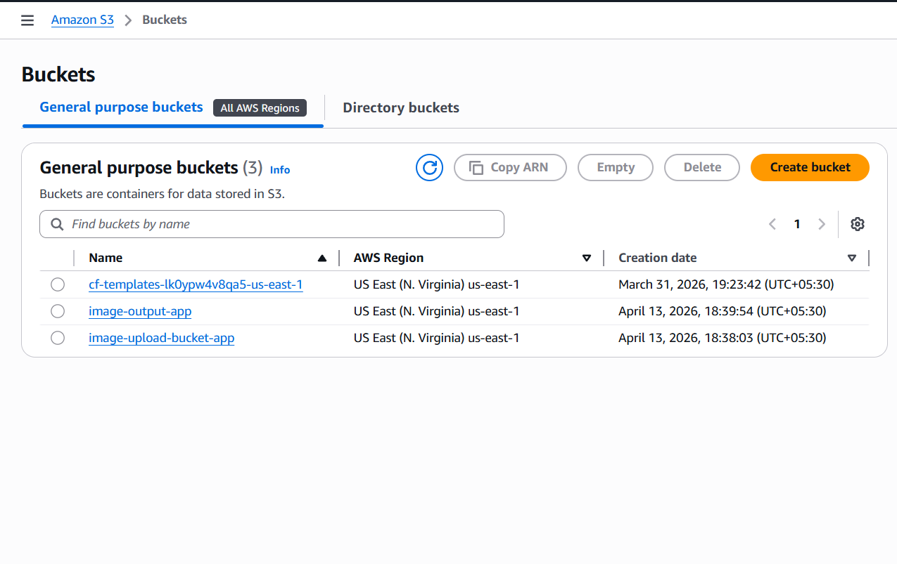
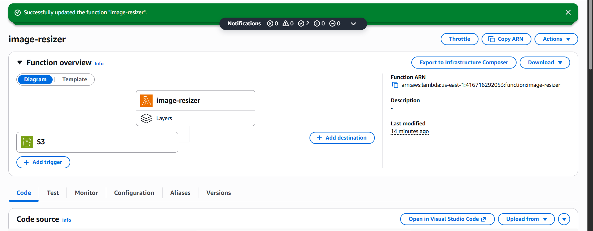
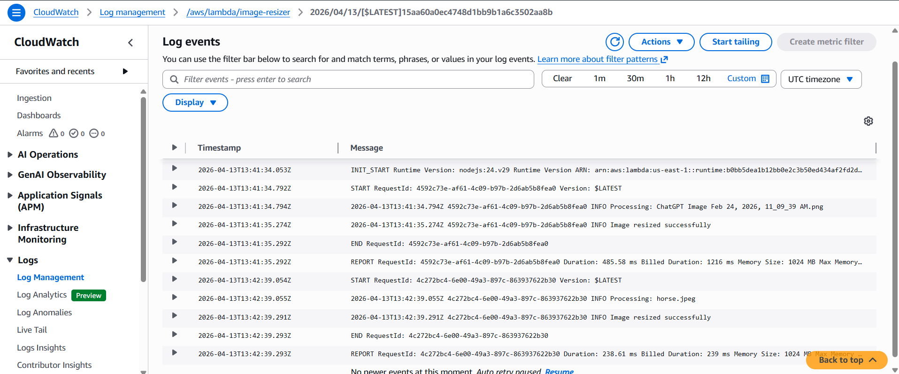
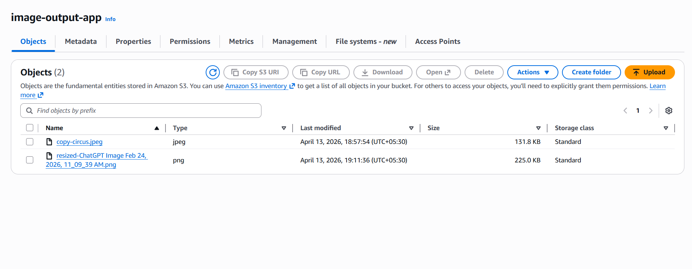

📌 Project Title

Serverless Image Processing Pipeline using AWS

📌 Overview

This project demonstrates a serverless architecture that automatically processes images uploaded to Amazon S3. When a user uploads an image, an AWS Lambda function is triggered to resize the image and store the processed version in another S3 bucket.

📌 Architecture
User Upload → S3 (Input Bucket) → Lambda → Resize (Sharp) → S3 (Output Bucket)
📌 AWS Services Used
Amazon S3
AWS Lambda
AWS CloudWatch
AWS IAM
📌 Features
Automatic image processing on upload
Serverless architecture (no servers required)
Image resizing using Sharp
Scalable and event-driven system
📌 Workflow
User uploads image to S3 input bucket
S3 triggers Lambda function
Lambda reads image and resizes it
Processed image is stored in output bucket
📌 Key Implementation Details
Runtime: Node.js 24
Image processing library: Sharp (via Lambda Layer)
Memory: 1024 MB
Timeout: 15 seconds
📌 Screenshots

(Add your screenshots here)

Example:

### S3 Buckets

### Lambda Function

### CloudWatch Logs

### Output Image

📌 Challenges Faced
Node.js 24 runtime compatibility issues
Sharp installation required Lambda Layer
Bucket naming mismatch caused deployment errors
📌 Outcome

Successfully built a scalable serverless pipeline that processes images automatically upon upload.
